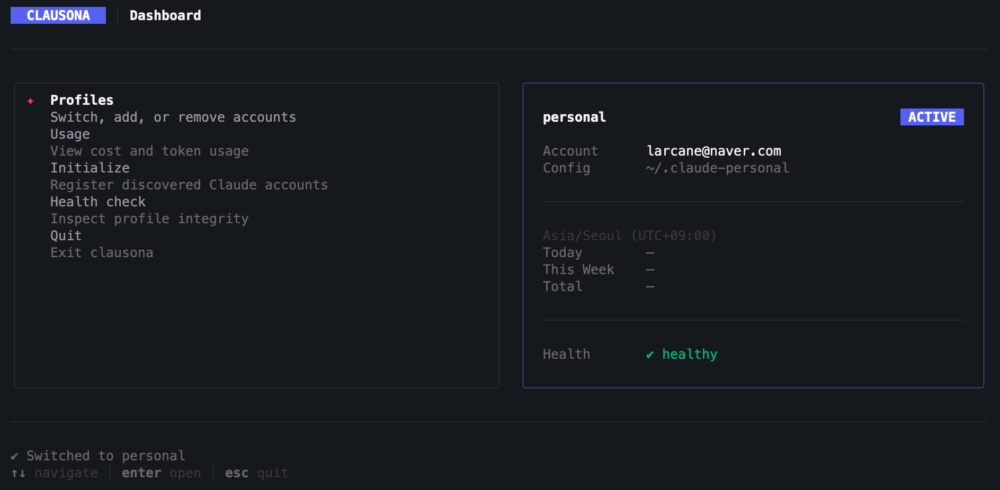

# clausona

**Switch between multiple Claude Code accounts on one machine — plugins, MCP servers, and settings stay shared.**

<p align="center">
  
</p>

## Why

You have multiple Claude Code accounts (personal, work, different orgs), but switching between them on a single machine is tedious:

- **Switching is manual.** You need to log out, log back in, or juggle `CLAUDE_CONFIG_DIR` yourself.
- **Settings don't carry over.** Each account gets its own config directory, so your MCP servers, plugins, permissions, and settings have to be set up from scratch — every time.

clausona fixes both. Switch profiles with one command — your entire environment carries over.

```bash
csn use work     # switch to work account — done
```

No re-login. No reinstalling plugins. Just switch and go.

> `csn` is a shorthand alias for `clausona`, registered automatically on install.

## Features

- **One-command switching** — `clausona use <name>` and you're on a different account
- **Shared environment** — MCP servers, plugins, permissions, and settings are symlinked across all profiles. Set up once, use everywhere.
- **Pure Claude Code** — no wrapping, no proxying, no background process. Claude Code runs directly and unmodified. Fully compatible with oh-my-claudecode, Cline, and any other tool in your stack.
- **Lightweight** — a single shell hook and a few symlinks. No daemon, no server, no runtime overhead.
- **Usage tracking** — per-profile cost and token usage, tracked locally
- **Interactive dashboard** — TUI for managing profiles, viewing usage, and running health checks

## Install

**Requirements:** Node.js >= 20, [Claude Code CLI](https://docs.anthropic.com/en/docs/claude-code)

**Platform:** macOS, zsh

```bash
curl -fsSL https://github.com/larcane97/clausona/releases/latest/download/install.sh | bash
```

## Quick Start

```bash
clausona init        # discover existing Claude Code accounts
clausona use work    # switch to a profile
clausona list        # see all profiles with weekly usage
clausona             # open the interactive dashboard
```

## Commands

| Command | Description |
|---------|-------------|
| `clausona` | Interactive TUI dashboard |
| `clausona init` | Discover and register Claude Code accounts |
| `clausona add <name> [--from <path>]` | Add a profile manually |
| `clausona remove <name>` | Remove a profile |
| `clausona use [name]` | Switch active profile |
| `clausona run <profile> [-- claude-args...]` | Run Claude Code with a specific profile |
| `clausona list [--json]` | List all profiles with usage |
| `clausona usage [name] [--period=today\|week\|month\|all]` | View cost and token usage |
| `clausona current [--json]` | Show active profile |
| `clausona doctor [--json]` | Check profile health |
| `clausona repair <name>` | Fix broken shared links |
| `clausona login <name>` | Re-authenticate a profile |
| `clausona uninstall` | Uninstall clausona completely |

## How It Works

### Profile Switching

A `claude()` shell wrapper is registered via `eval "$(clausona shell-init)"`:

1. **Before** each `claude` invocation — reads `~/.clausona/profiles.json` and sets `CLAUDE_CONFIG_DIR` to the active profile's config directory
2. **After** each `claude` invocation — detects usage changes via fingerprint comparison and records cost/token usage per profile

```
clausona use work
↓
claude             ← wrapper sets CLAUDE_CONFIG_DIR, then runs claude
↓
_track-usage       ← on exit, records any new cost/token usage
```

### Shared Environment

When you register a new profile, clausona symlinks shared resources from your primary `~/.claude` into the new profile's config directory:

```
~/.claude-work/            (new profile)
├── .claude.json           ← own auth credentials (NOT shared)
├── mcp-servers/  →  ~/.claude/mcp-servers    (symlink to primary)
├── plugins/      →  ~/.claude/plugins        (symlink to primary)
├── settings.json →  ~/.claude/settings.json  (symlink to primary)
└── ...
```

Only `.claude.json` stays profile-specific. Everything else is shared automatically.

### Data Storage

All data stays local on your machine.

```
~/.clausona/
├── profiles.json    # registered profiles and active selection
├── usage.json       # per-profile usage history
├── profiles/        # config directories for created profiles
└── backups/         # backups of imported profile directories
```

## Contributing

Issues and pull requests are welcome at [github.com/larcane97/clausona](https://github.com/larcane97/clausona).

## License

MIT
