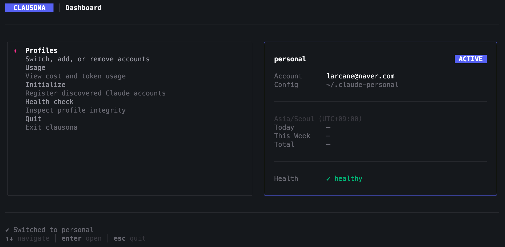

# clausona

**Switch between multiple Claude Code and OpenAI Codex CLI accounts on one machine — plugins, MCP servers, and settings stay shared.**

<p align="center">
  
</p>

## Why

You have multiple Claude Code or OpenAI Codex CLI accounts (personal, work, different orgs), but switching between them on a single machine is tedious:

- **Switching is manual.** You need to log out, log back in, or juggle `CLAUDE_CONFIG_DIR` (Claude) or `CODEX_HOME` (Codex) yourself.
- **Settings don't carry over.** Each account gets its own config directory, so your MCP servers, plugins, permissions, and settings have to be set up from scratch — every time.

clausona fixes both. Switch profiles with one command — your entire environment carries over.

```bash
csn use work             # switch to work account — done
csn use codex:personal   # switch to your personal codex account too
```

No re-login. No reinstalling plugins. Just switch and go.

> `csn` is a shorthand alias for `clausona`, registered automatically on install.

## Features

- **One-command switching** — `clausona use <name>` and you're on a different account
- **Shared environment** — MCP servers, plugins, permissions, settings (Claude) and config.toml, skills, hooks (Codex) are symlinked across profiles within each tool. Set up once, use everywhere.
- **Pure CLI passthrough** — no wrapping, no proxying, no background process. `claude` and `codex` run directly and unmodified. Compatible with oh-my-claudecode, Cline, codex plugins, and any other tool in your stack.
- **Lightweight** — a single shell hook and a few symlinks. No daemon, no server, no runtime overhead.
- **Plan quota at a glance** — session and weekly limit usage for every account, read live from each tool's own usage endpoint (Claude and Codex)
- **Usage tracking** — per-profile cost and token usage, tracked locally (Claude only in v0.1)
- **Interactive dashboard** — TUI for managing profiles, viewing usage, and running health checks

## Install

**Requirements:** Node.js >= 20, and at least one of:

- [Claude Code CLI](https://docs.anthropic.com/en/docs/claude-code)
- [OpenAI Codex CLI](https://github.com/openai/codex)

**Platforms:** macOS/Linux (zsh or bash) and Windows (PowerShell 5.1+)

macOS/Linux:

```bash
curl -fsSL https://github.com/larcane97/clausona/releases/latest/download/install.sh | bash
```

Piping to `bash` does not read your shell profile, so if Node comes from a version
manager (nvm, fnm, asdf), activate it before running the command.

Windows PowerShell:

```powershell
irm https://github.com/larcane97/clausona/releases/latest/download/install.ps1 | iex
```

## Quick Start

```bash
clausona init             # discover existing Claude Code and Codex accounts
clausona use work         # switch to a profile (bare name if unique)
clausona use claude:work  # switch claude account (use prefix when both tools have "work")
clausona add codex:work   # add a codex profile
clausona use codex:personal  # switch codex account
clausona list             # see all profiles with plan quota and weekly usage
clausona                  # open the interactive dashboard
```

## Plan quota

`clausona list` and the dashboard show how much of each account's plan limits are
already spent, so you can pick a profile that still has headroom.

```
PROFILE             ACCOUNT                      5H         7D
claude:work         you@example.com              6% 23m     46% 13h
claude:personal     you@personal.com             0%         100% 4d
codex:work          you@example.com              —          12% 5d
```

`5H` is the rolling session window, `7D` the weekly one, each followed by how long
until it resets. The dashboard shows the same reading with a gauge and the precise
reset time, plus the most-consumed per-model limit.

The table adapts to the terminal: as it narrows, token counts give way first, then
cost, then the reset times — the quota columns and the profile name are the last things
to go, so the row never wraps into itself.

Readings come from each tool's own usage endpoint, authenticated with the credential
that tool already stored for that profile — clausona never asks for or stores a token
of its own. Results are cached for 5 minutes; `--refresh` forces a re-read and
`--no-quota` skips the network entirely.

### Profiles you have not used recently

An access token lasts 8 hours, so a profile you have not touched today would otherwise
show nothing. clausona renews it on demand using the stored refresh token, which lasts
about 14 days — so every account you have used in the last two weeks reports its quota,
whether or not you have switched to it lately.

Renewal is lazy: a token is only renewed once it has actually lapsed (or if the endpoint
rejects it), never pre-emptively, so each profile rotates at most once per 8 hours.
`--no-renew` turns it off.

Two details make this safe to do on your behalf, and both are worth knowing if you touch
this code:

- **The refresh token rotates with no grace period.** The moment the provider answers,
  the previous refresh token is rejected. The renewed credential is therefore written
  and read back before the call returns; a write that cannot be verified is an error,
  never a silent fallback.
- **Renewal is locked per profile**, so two clausona processes cannot both rotate the
  same credential and leave one of them holding a token the provider has already
  invalidated.

Claude credentials stay in the macOS Keychain (or `.credentials.json` elsewhere) and
Codex credentials in `auth.json`, in place — unrelated contents of those stores, such as
Claude's `mcpOAuth` block, are preserved.

### When a reading is unavailable

A dash means the reading could not be taken, and the reason is printed below the table:

| State | Meaning |
| --- | --- |
| `expired` | The sign-in has lapsed past renewal (refresh token older than ~14 days, or revoked). Run `clausona login <profile>`. |
| `missing` | No credential is stored for the profile. Run `clausona login <profile>`. |
| `cooldown` | The endpoint returned 429. clausona pauses that tool until the window lifts. |
| `error` | Network failure, timeout, or an unreadable response. |

Where numbers are already known, they stay on screen dimmed with their age, rather than
being blanked out.

## Commands

`<profile>` accepts either a bare name (e.g. `work`) when it is unique across all tools, or a `tool:name` prefix (e.g. `claude:work`, `codex:work`) when disambiguation is needed.

| Command                                                             | Description                                          |
| ------------------------------------------------------------------- | ---------------------------------------------------- |
| `clausona`                                                          | Interactive TUI dashboard                            |
| `clausona init`                                                     | Discover and register Claude Code and Codex accounts |
| `clausona add <profile> [--from <path>] [--merge-sessions]`         | Add a profile manually                               |
| `clausona remove <profile>`                                         | Remove a profile                                     |
| `clausona use [profile]`                                            | Switch active profile                                |
| `clausona run <profile> [-- args...]`                               | Run the tool's CLI with a specific profile           |
| `clausona list [--json] [--refresh] [--no-quota] [--no-renew]`      | List all profiles with plan quota and usage          |
| `clausona usage [profile] [--period=today\|week\|month\|all]`       | View cost and token usage                            |
| `clausona current [--json]`                                         | Show active profile                                  |
| `clausona config <profile> --merge-sessions \| --separate-sessions` | Configure session mode                               |
| `clausona doctor [--json]`                                          | Check profile health                                 |
| `clausona repair <profile>`                                         | Fix broken shared links                              |
| `clausona login <profile>`                                          | Re-authenticate a profile                            |
| `clausona uninstall`                                                | Uninstall clausona completely                        |

## How It Works

### Profile Switching

Shell wrappers for `claude` and `codex` are registered via `eval "$(clausona shell-init)"` on zsh/bash or
`Invoke-Expression (& clausona shell-init | Out-String)` on PowerShell:

1. **Before** each invocation — reads `~/.clausona/profiles.json` and sets the appropriate env var (`CLAUDE_CONFIG_DIR` for claude, `CODEX_HOME` for codex) to the active profile's config directory
2. **After** each `claude` invocation — detects usage changes via fingerprint comparison and records cost/token usage per profile

```
clausona use work
↓
claude             ← wrapper sets CLAUDE_CONFIG_DIR, then runs claude
↓
_track-usage       ← on exit, records any new cost/token usage

clausona use codex:personal
↓
codex              ← wrapper sets CODEX_HOME, then runs codex
```

### Shared Environment

When you register a new profile, clausona symlinks shared resources from your primary config directory into the new profile's config directory.

**Claude profile** (`clausona add claude:work`):

```
~/.claude-work/            (new claude profile)
├── .claude.json           ← own auth credentials (NOT shared)
├── projects/              ← own session history (NOT shared by default)
├── jobs/                  ← own background sessions (follows projects/)
├── teams/                 ← own team records (follows projects/)
├── mcp-servers/  →  ~/.claude/mcp-servers    (symlink to primary)
├── plugins/      →  ~/.claude/plugins        (symlink to primary)
├── settings.json →  ~/.claude/settings.json  (symlink to primary)
└── ...
```

**Codex profile** (`clausona add codex:work`):

```
~/.codex-work/             (new codex profile)
├── auth.json              ← own credentials (NOT shared)
├── sessions/              ← own conversation history (NOT shared)
├── history.jsonl          ← own input history (NOT shared)
├── state_*.sqlite         ← own state DB (NOT shared)
├── config.toml  →  ~/.codex/config.toml      (symlink to primary)
├── skills/      →  ~/.codex/skills           (symlink to primary)
├── plugins/cache/ → ~/.codex/plugins/cache   (symlink to primary)
└── ...
```

The private set is larger for codex (state DB, input history, logs) but the principle is the same: credentials and session data stay profile-specific; everything else is shared.

On Windows, shared directories use junctions. Shared files use symbolic links when Windows Developer Mode is enabled and
otherwise fall back to same-volume hard links. If a profile is imported from another drive, enable Developer Mode so
clausona can create file symbolic links across volumes.

**Session separation** is the default: each profile keeps its own session directory, so `/resume` (Claude) and `codex resume` (Codex) only show that profile's conversations. To share session history across claude profiles, pass `--merge-sessions` when adding or initializing.

For claude profiles this covers background sessions and team records too. A background
session is stored as a record in `jobs/` keyed by the same session id as its transcript
under `projects/`, so the two are shared or separated together — sharing one without the
other would leave a record whose transcript cannot be resumed. `clausona repair` folds a
profile's own records into the primary before re-linking, so nothing is lost when a
profile switches to shared sessions or has its links rebuilt.

Shared links are created from the primary's contents at the time a profile is set up, so
a directory the tool introduces in a later version does not reach profiles that already
exist — the tool creates it locally instead, and the accounts silently stop sharing that
state. `clausona doctor` reports these as `missing_shared_link`; `clausona repair
<profile>` links them.

### Data Storage

All data stays local on your machine. clausona has no telemetry and no server of its
own, and nothing is sent to a third party.

The one thing that leaves your machine is the plan-quota lookup: each profile's own
credential is sent to that profile's own provider endpoint (`api.anthropic.com` for
Claude, `chatgpt.com` for Codex) to read its limits, and to renew a lapsed token.
Nothing else is transmitted, and `clausona list --no-quota` skips it entirely.

```
~/.clausona/
├── profiles.json    # registered profiles and active selection
├── usage.json       # per-profile usage history
├── quota.json       # cached plan-quota readings (5-minute freshness)
├── locks/           # short-lived per-profile credential renewal locks
└── backups/
    ├── claude/      # backups of imported claude profile directories
    └── codex/       # backups of imported codex profile directories

~/.claude-<name>/        # claude profile config directories (created by `clausona add`)
~/.codex-<name>/         # codex profile config directories (created by `clausona add codex:<name>`)
```

## Migration from 0.0.x

clausona 0.1.0-beta introduces multi-tool support. On first launch, the registry at `~/.clausona/profiles.json` is automatically migrated to v2 format:

- Profile names are prefixed with their tool: `work` → `claude:work`
- Per-tool active profiles, per-tool primary sources
- Backup files saved with `.v1.bak` suffix

To roll back: restore the `.v1.bak` files and install the previous clausona version.

## Contributing

Issues and pull requests are welcome at [github.com/larcane97/clausona](https://github.com/larcane97/clausona).

## License

MIT
