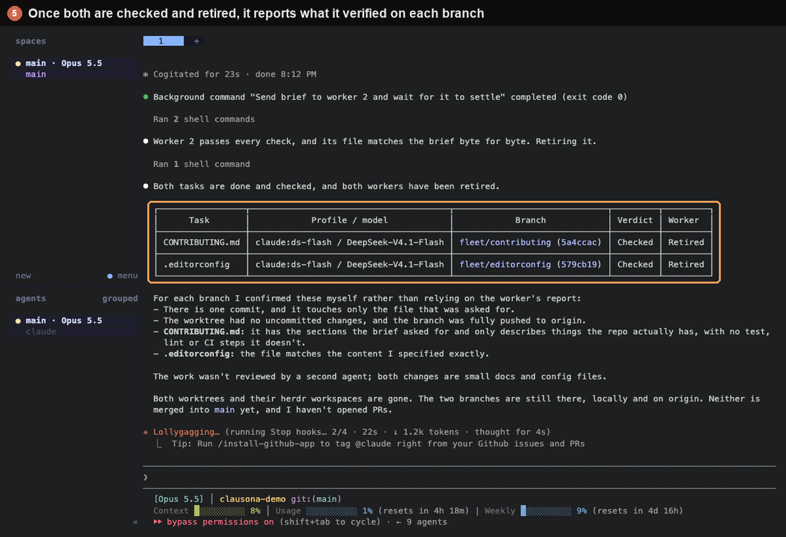

# Run a herdr fleet across your accounts



[herdr](https://github.com/ogulcancelik/herdr) keeps coding agents running in terminal panes and
shows each one's state in its sidebar. clausona gives each of those agents its own account. With
both, one Claude Code or Codex session in a herdr pane can split a job across several workers,
each on a different account or an API model, and you can switch to any worker's pane and type
into it.

The `herdr-fleet` plugin from this repo teaches the coordinating session how to do it. The same
pattern runs in [Superset](superset-fleet.md) and [Orca](orca-fleet.md).

## Why not subagents?

Subagents run inside one session, out of sight, on that session's account. A herdr worker is an
ordinary Claude Code or Codex session in its own pane and git worktree, on the account you pick.
The [parallel agents guide](https://larcane97.github.io/clausona/guides/parallel-claude-code-agents/)
has the longer version.

## How it fits together

1. **It picks the profiles.** It uses the profiles and rules you give it, in the request or in
   `~/.clausona/fleet.json`. For the rest it reads every profile's limits with `clausona list`,
   picks profiles of its own tool with headroom, and never uses its own.
2. **It starts the workers.** For each task it runs `herdr worktree create`, which adds a
   workspace labelled `<task> · <profile>` to the sidebar, then starts
   `clausona run <profile> -- …` in that workspace's pane.
3. **It watches them.** It sends each brief with `herdr agent prompt … --wait` and is woken when
   a worker finishes its turn or stops at a question. herdr's agents list shows every worker as
   working, idle, blocked or done.
4. **It checks and retires.** When a worker says it is done, the orchestrator checks the branch
   itself. Then it removes the worktree with `herdr worktree remove`, after asking you (the
   default) or automatically. The branch stays.

## Setup

1. **Add your profiles to clausona.** [Install clausona](../../README.md#install), then
   `clausona add claude:work` per account, or an API model such as
   `clausona add claude:glm --api --base-url https://openrouter.ai/api --model z-ai/glm-5.3`.
2. **Install herdr** ([releases](https://github.com/ogulcancelik/herdr/releases): macOS, Linux and
   Windows builds).
3. **Install the plugin.** clausona shares plugins across profiles, so one install reaches every
   profile:

   ```bash
   claude plugin marketplace add larcane97/clausona
   claude plugin install herdr-fleet@clausona      # fleet-core comes along
   ```

   In Codex, which has no plugin dependencies, add `fleet-core` yourself:

   ```bash
   codex plugin marketplace add larcane97/clausona
   codex plugin add fleet-core@clausona
   codex plugin add herdr-fleet@clausona
   ```

4. **Start each new profile once by hand** (`clausona run claude:work`). Its first session can ask
   one-time questions, and a worker would wait at them.

## A run

Open a pane in herdr, start Claude Code or Codex in your repo, and ask:

> Split these across my accounts in herdr: add a `--json` flag to `notes list`, and write tests
> for `src/parse.ts`.

The orchestrator shows a table of tasks and profiles. When neither your request nor your settings
named a profile, it waits for your OK. Then it starts the workers one by one, reads each as it
finishes, checks the branches, and tells you what it checked and what the worker only claimed.

Things it handles on the way:

- **Folder trust.** Claude Code and Codex ask once per repository (Claude Code once per profile too) whether to trust it. herdr shows
  that as `blocked`; the orchestrator reads the screen and answers it for the repo you asked it to
  work on, and nothing else.
- **Account limits.** If a worker stops at a usage limit, the orchestrator opens a pane next to it
  on another profile and hands the task over.
- **Retiring.** `herdr worktree remove` refuses a worktree with uncommitted changes, and the
  orchestrator never forces it. It also checks that the branch is pushed first.

## Settings

The same `~/.clausona/fleet.json` as the other fleet plugins: `workers`, `routing`, `maxUsage`,
`retire` and `permissions`. See [the Superset page](superset-fleet.md#settings) for each key.

## Codex

- A Codex session can be the orchestrator. It waits for workers a few minutes at a time, since
  Codex has no background tasks that wake it.
- Workers use the orchestrator's tool. A Codex worker in a Claude Code fleet, or the other way
  round, runs only when you name that profile or list it in `workers`.
- Codex workers start with `--disable hooks`, so they never stop at Codex's "Hooks need review"
  screen. Trusting hooks stays your call.
- In Codex's default `workspace-write` sandbox, `.git` is read-only and there is no network, so a
  Codex worker asks before it commits and again before it pushes. The orchestrator never answers
  those prompts: it tells you which worker waits, and you approve in that worker's pane. To let
  Codex workers commit and push on their own, set `"codexSandbox": "danger-full-access"` under
  `permissions`, which turns Codex's sandbox off for them.
- If your Codex config has `[shell_environment_policy] inherit = "core"` (or `"none"`), Codex
  hides herdr's variables from the commands it runs, and the orchestrator cannot reach herdr.
  Start that Codex session with `-c shell_environment_policy.inherit=all`.

## Limits

- The orchestrator must run inside a herdr pane (`HERDR_ENV=1`). herdr's CLI talks to the session
  of the pane it runs in.
- herdr reads each pane's screen to tell an agent's state. It recognizes Claude Code and Codex
  started through `clausona run`.
