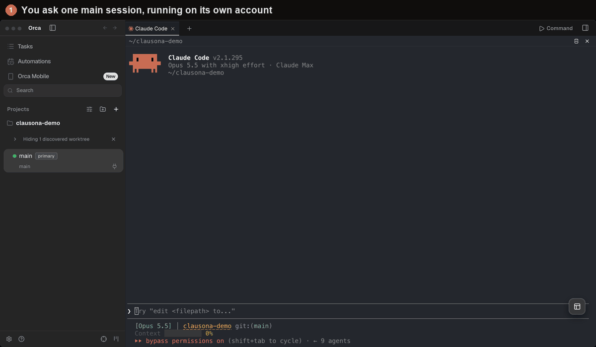

# Run an Orca fleet across your accounts



[Orca](https://github.com/stablyai/orca) runs coding agents side by side, each in its own git
worktree, and lists them in its sidebar. clausona gives each of those agents its own account.
With both, one Claude Code or Codex session can split a job across several Orca worktrees, each
worker on a different account or an API model, and you can open any worker's tab and type into it.

The `orca-fleet` plugin from this repo teaches the coordinating session how to do it. The same
pattern runs in [Superset](superset-fleet.md) and [herdr](herdr-fleet.md).

## Why not subagents?

Subagents run inside one session, out of sight, on that session's account. An Orca worker is an
ordinary Claude Code or Codex session in its own worktree and tab, on the account you pick. The
[parallel agents guide](https://larcane97.github.io/clausona/guides/parallel-claude-code-agents/)
has the longer version.

## How it fits together

1. **It picks the profiles.** It uses the profiles and rules you give it, in the request or in
   `~/.clausona/fleet.json`. For the rest it reads every profile's limits with `clausona list`,
   picks profiles of its own tool with headroom, and never uses its own.
2. **It starts the workers.** For each task it runs `orca worktree create`, names the worktree
   `<task> · <profile>` so the sidebar shows which account runs where, opens a terminal there, and
   sends `clausona run <profile> -- …` once the shell is ready.
3. **It watches them.** After each brief it waits with `orca terminal wait --for tui-idle` and
   reads the worker's screen. For Claude Code workers, Orca's sidebar also shows the state, and
   `orca worktree ps` gives the last reply.
4. **It checks and retires.** When a worker says it is done, the orchestrator checks the branch
   itself. Then it removes the worktree with `orca worktree rm`, after asking you (the default) or
   automatically.

## Setup

1. **Add your profiles to clausona.** [Install clausona](../../README.md#install), then
   `clausona add claude:work` per account, or an API model such as
   `clausona add claude:glm --api --base-url https://openrouter.ai/api --model z-ai/glm-5.3`.
2. **Install Orca** ([releases](https://github.com/stablyai/orca/releases): macOS, Windows and
   Linux) and keep it open. The `orca` command talks to the running app.
3. **Install the plugin.** clausona shares plugins across profiles, so one install reaches every
   profile:

   ```bash
   claude plugin marketplace add larcane97/clausona
   claude plugin install orca-fleet@clausona       # fleet-core comes along
   ```

   In Codex, which has no plugin dependencies, add `fleet-core` yourself:

   ```bash
   codex plugin marketplace add larcane97/clausona
   codex plugin add fleet-core@clausona
   codex plugin add orca-fleet@clausona
   ```

4. **Start each new profile once by hand** (`clausona run claude:work`). Its first session can ask
   one-time questions, and a worker would wait at them.

## A run

In an Orca terminal in your repo, start Claude Code or Codex and ask:

> Split these across my accounts in Orca: add a `--json` flag to `notes list`, and write tests
> for `src/parse.ts`. Run the tests task on DeepSeek.

The orchestrator shows a table of tasks and profiles and, since you named one, starts at once.
It reads each worker as it finishes, checks the branches, and tells you what it checked and what
the worker only claimed.

Things it handles on the way:

- **Orca's own accounts.** Orca has its own account switcher and sets `CODEX_HOME` in its
  terminals. The orchestrator always starts workers with `clausona run`, which picks the account
  for that terminal and overrides Orca's.
- **Folder trust.** Claude Code and Codex ask once per repository (Claude Code once per profile too) whether to trust it. The
  orchestrator answers that question for the repo you asked it to work on, and nothing else.
- **MCP servers.** Orca's worktrees live under `~/orca/workspaces`, so a `~/.mcp.json` in your
  home directory would make Claude Code ask about "new MCP servers". Workers start with
  `--strict-mcp-config`, which keeps that question away.
- **Retiring.** `orca worktree rm` refuses a worktree with uncommitted changes, and the
  orchestrator never forces it. Orca also deletes the worktree's local branch, so the orchestrator
  retires a worker only after its branch is pushed.

## Settings

The same `~/.clausona/fleet.json` as the other fleet plugins: `workers`, `routing`, `maxUsage`,
`retire` and `permissions`. See [the Superset page](superset-fleet.md#settings) for each key.

## Codex

- A Codex session can be the orchestrator. It waits for workers a few minutes at a time, since
  Codex has no background tasks that wake it.
- Workers use the orchestrator's tool. A Codex worker in a Claude Code fleet, or the other way
  round, runs only when you name that profile or list it in `workers`.
- Codex workers do not appear in Orca's agent list: Orca's Codex hooks live in Orca's own Codex
  home, not the profile's. The orchestrator reads their screens instead.
- In Codex's default `workspace-write` sandbox, `.git` is read-only and there is no network, so a
  Codex worker asks before it commits and again before it pushes. The orchestrator never answers
  those prompts: it tells you which worker waits, and you approve in that worker's tab. To let
  Codex workers commit and push on their own, set `"codexSandbox": "danger-full-access"` under
  `permissions`, which turns Codex's sandbox off for them.

## Limits

- Orca must be open on the same machine.
- `orca terminal read` returns scrollback only, so the orchestrator reads a worker's current screen
  from `orca terminal show`.
