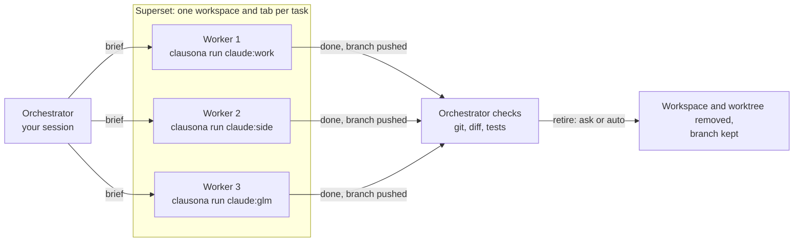

# Run a Superset fleet across your accounts


[Superset](https://superset.sh) runs many coding agents side by side, each in its own git
worktree and its own tab. clausona gives each of those agents its own account. With both, one
Claude Code or Codex session can split a job across several workers. Each worker draws on a
different account's limits, or on an API model. You watch every one of them in Superset, and
step in whenever you like.

The `superset-fleet` skill, shipped as a plugin from this repo, teaches the coordinating
session how to do it. The same pattern runs in [herdr](herdr-fleet.md) and [Orca](orca-fleet.md).

## Why not subagents?

- **Limits.** Subagents spend the limits of the account their session runs on. A fan-out of
  five uses up one account's 5-hour window five times as fast.
- **Visibility.** A subagent runs out of sight. You see its result, not its work, and you
  cannot type into it.
- **Each Superset worker is an ordinary Claude Code or Codex session in a tab.** You can read along,
  answer its questions, or stop it.

## How it fits together



1. **It picks the profiles.** It uses the profiles and rules you give it, in the request or in
   a settings file. For the rest it reads every profile's limits with `clausona list` and gives
   each task a profile with headroom, never its own.
2. **It starts the workers.** It creates a Superset workspace per task and starts the worker
   with that profile's Superset agent.
3. **It watches them.** It reads the workers' terminals and answers what they ask. If an
   account runs out, it moves that task to another profile.
4. **It checks and retires.** When a worker says it is done, the orchestrator checks the branch
   itself. Then it retires the worker: after asking you (the default), or automatically.

## Setup

1. **Add your profiles to clausona.** [Install clausona](../../README.md#install), then add a
   profile per account:

   ```bash
   clausona add claude:work
   ```

   An API model works too, through any endpoint that speaks the Anthropic Messages format, for
   example OpenRouter:

   ```bash
   clausona add claude:glm --api --base-url https://openrouter.ai/api --model z-ai/glm-5.3
   ```

2. **Make each worker profile a Superset agent.** In Superset → Settings → Agents, add a
   custom agent per profile:
   - Command: the output of `command -v clausona`.
   - Arguments: `run claude:work -- --model claude-sonnet-5-5 --effort high --permission-mode acceptEdits --strict-mcp-config`.

   Put the model and the effort here, because Superset does not pass them to custom agents at
   launch. `--strict-mcp-config` keeps a worker from stopping at Claude Code's "new MCP servers
   found" question. For an API model, also add `--tools=Bash,Read,Edit,Write,Grep,Glob`.
   Without the Superset CLI logged in, the skill can add these agents itself, after asking you.

   Start each new profile once by hand (`clausona run claude:work`). Its first session can ask
   one-time questions, such as an API-key profile's "Detected a custom API key", and a worker
   would wait at them.

3. **Install the plugin.** clausona shares plugins across profiles, so one install reaches every
   profile. `fleet-core`, the rules all fleet plugins share, comes along with it:

   ```bash
   claude plugin marketplace add larcane97/clausona
   claude plugin install superset-fleet@clausona
   ```

   In Codex, which has no plugin dependencies, add `fleet-core` yourself:

   ```bash
   codex plugin marketplace add larcane97/clausona
   codex plugin add fleet-core@clausona
   codex plugin add superset-fleet@clausona
   ```

   In Claude Code, `clausona@clausona` is now an alias: installing it installs `superset-fleet`.
   If you installed it before, updating it does not add the new plugin, and Claude Code reports a
   missing dependency: run `claude plugin install superset-fleet@clausona` once. In Codex the alias
   no longer carries a skill, so run the three commands above.

## A run

In a Claude Code or Codex session in a Superset project, ask for the work:

> Split these across my accounts in Superset: add a `--json` flag to `notes list`, write tests
> for `src/parse.ts`, and fix the broken links in `docs/`.

The orchestrator then:

1. Shows a table of the tasks and the profile each will run on, chosen by headroom. When
   neither your request nor your settings named a profile, it waits for your OK.
2. Creates a workspace per task, named after the task and the profile, so the sidebar shows
   which account runs where. It starts each worker with its brief. The brief tells the worker
   to push its branch, to start no agents of its own, and to report done or blocked.
3. Reads the workers as they go. It answers their questions, and hands a task to another
   profile if an account hits its limit.
4. Checks each finished branch itself: the commits, the diff, and the checks the brief named.
   It tells you what it checked and what the worker only claimed.
5. Offers to retire the finished workers.

## Settings

Settings live in `~/.clausona/fleet.json`, shared by every fleet plugin. An older
`~/.clausona/superset-fleet.json` is still read until the first change, which writes `fleet.json`.
What you say in the conversation wins over the file, and the file wins over the defaults.

**Choosing the workers.**
- By default any profile with headroom can be a worker, except the orchestrator's own, as long
  as it belongs to the orchestrator's tool: Claude Code profiles for a Claude Code session, Codex
  profiles for a Codex session. The other tool's profiles are used only when you name them or list them in `workers`. A
  profile at 90% or more of its 5-hour or weekly limit is skipped.
- To choose them yourself, name them in the request, or set them in the file:

  ```json
  {
    "workers": ["claude:work", "claude:side", "claude:glm"],
    "routing": ["claude:glm never edits files under src/"],
    "maxUsage": 80
  }
  ```

  - `workers`: the only profiles that can be workers.
  - `routing`: your own rules for which task goes where, in plain words.
  - `maxUsage`: the usage, in percent, at which a profile is skipped. The default is 90.
  - `permissions`: how workers run, per tool, for example
    `{"claude": "acceptEdits", "codex": "on-request", "codexSandbox": "workspace-write"}`. The
    orchestrator asks once if it needs one that is missing. `codexSandbox` is
    `workspace-write` (the default) or `danger-full-access`; see the Codex notes below for what that
    means for commits.
- Or tell the orchestrator, for example "never use claude:personal for workers", and it updates
  the file.

**Retiring finished workers.**
- By default the orchestrator asks before retiring anything.
- To retire automatically, tell it "always retire finished workers", or set `retire` in the
  file:

  ```json
  { "retire": "auto" }
  ```

- A worker is retired only when its work was checked, its branch is pushed and its worktree
  is clean. Superset removes a worktree with whatever is in it, so the skill's helper checks
  the worktree and the branch right before the delete, and refuses when either is not clean.

**With or without the Superset CLI.**
- With the CLI logged in (`superset auth login`), the skill uses it.
- Without it, the skill uses a small helper it bundles. The helper makes the same calls to the
  Superset app's local host service that the CLI makes.
- That service is not a documented API. If a Superset update changes it, the helper says so
  and stops. Then update the plugin, or log the CLI in.

**API models as workers.**
- Give them small, explicit briefs: the file, the function, the change, and the command that
  checks it.
- Check whether your endpoint honours prompt caching. Without it, every turn re-reads the whole
  conversation and long sessions slow down.

**Codex.**
- A Codex session can be the orchestrator. It uses `superset-orchestrate`, the Codex copy of
  Superset's protocol that Superset installs in `~/.agents/skills`, and waits for workers a few
  minutes at a time.
- A Codex worker runs through an agent whose arguments are, for example,
  `run codex:personal -- -s workspace-write -a on-request -c check_for_update_on_startup=false -c mcp_servers={}`.
  In a Superset terminal the `codex` it starts goes through Superset's wrapper, so Superset sees
  each turn end, the same as for Claude Code workers.
- In Codex's `workspace-write` sandbox, `.git` is read-only and there is no network, so a Codex
  worker asks before it commits and again before it pushes. With `on-request` you approve each
  one in its terminal; with `never` they fail. A Codex worker commits and pushes on its own only
  with `"codexSandbox": "danger-full-access"`, which turns Codex's sandbox off.
- The first Codex worker in a repo that Codex never trusted asks "Trust this folder?". The
  orchestrator answers it for the repo you asked it to work on.

## Limits

- Superset must be running on the same machine (the desktop app, or `superset start`).
- The orchestrator is the only session that coordinates. Workers start no agents of their own.
