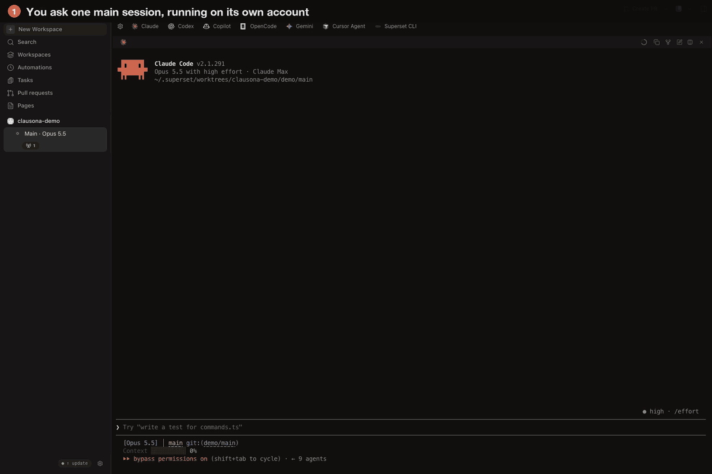
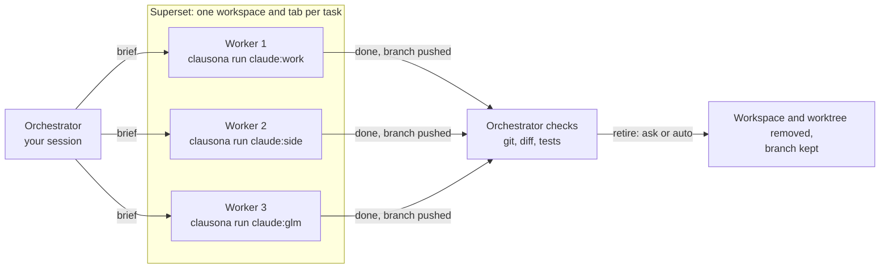

# Run a Superset fleet across your accounts



[Superset](https://superset.sh) runs many coding agents side by side, each in its own git
worktree and its own tab. clausona gives each of those agents its own account. With both, one
Claude Code session can split a job across several workers. Each worker draws on a different
account's limits, or on an API model. You watch every one of them in Superset, and step in
whenever you like.

The `superset-fleet` skill, shipped as a plugin from this repo, teaches the coordinating
session how to do it.

## Why not subagents?

- **Limits.** Subagents spend the limits of the account their session runs on. A fan-out of
  five uses up one account's 5-hour window five times as fast.
- **Visibility.** A subagent runs out of sight. You see its result, not its work, and you
  cannot type into it.
- **Each Superset worker is an ordinary Claude Code session in a tab.** You can read along,
  answer its questions, or stop it.

## How it fits together



1. **It picks the profiles.** The orchestrator reads every profile's limits with
   `clausona list` and gives each task a profile with headroom, never its own.
2. **It starts the workers.** It creates a Superset workspace per task and starts the worker
   with that profile's Superset agent.
3. **It watches them.** It reads the workers' terminals and answers what they ask. If an
   account runs out, it moves that task to another profile.
4. **It checks and retires.** When a worker says it is done, the orchestrator checks the branch
   itself. Then it retires the worker: after asking you (the default), or automatically.

## Setup

1. **Add your profiles to clausona.** [Install clausona](../../README.md#install), then add a
   profile per account:

   ```bash
   clausona add claude:work
   ```

   An API model works too, through any endpoint that speaks the Anthropic Messages format, for
   example OpenRouter:

   ```bash
   clausona add claude:glm --api --base-url https://openrouter.ai/api --model z-ai/glm-5.3
   ```

2. **Make each worker profile a Superset agent.** In Superset → Settings → Agents, add a
   custom agent per profile:
   - Command: the output of `command -v clausona`.
   - Arguments: `run claude:work -- --model claude-sonnet-5-5 --effort high --permission-mode acceptEdits --strict-mcp-config`.

   Put the model and the effort here, because Superset does not pass them to custom agents at
   launch. `--strict-mcp-config` keeps a worker from stopping at Claude Code's "new MCP servers
   found" question. For an API model, also add `--tools=Bash,Read,Edit,Write,Grep,Glob`.
   Without the Superset CLI logged in, the skill can add these agents itself, after asking you.

   Start each new profile once by hand (`clausona run claude:work`). Its first session can ask
   one-time questions, such as an API-key profile's "Detected a custom API key", and a worker
   would wait at them.

3. **Install the plugin.** clausona shares plugins across profiles, so one install reaches every
   profile:

   ```bash
   claude plugin marketplace add larcane97/clausona
   claude plugin install clausona@clausona
   ```

## A run

In a Claude Code session in a Superset project, ask for the work:

> Split these across my accounts in Superset: add a `--json` flag to `notes list`, write tests
> for `src/parse.ts`, and fix the broken links in `docs/`.

The orchestrator then:

1. Shows a table of the tasks and the profile each will run on, chosen by headroom.
2. Creates a workspace per task, named after the task and the profile, so the sidebar shows
   which account runs where. It starts each worker with its brief. The brief tells the worker
   to push its branch, to start no agents of its own, and to report done or blocked.
3. Reads the workers as they go. It answers their questions, and hands a task to another
   profile if an account hits its limit.
4. Checks each finished branch itself: the commits, the diff, and the checks the brief named.
   It tells you what it checked and what the worker only claimed.
5. Offers to retire the finished workers.

## Settings

**Retiring finished workers.**
- By default the orchestrator asks before retiring anything.
- To retire automatically, tell it "always retire finished workers", or create
  `~/.clausona/superset-fleet.json`:

  ```json
  { "retire": "auto" }
  ```

- A worker is retired only when its work was checked, its branch is pushed and its worktree
  is clean. Superset removes a worktree with whatever is in it.

**With or without the Superset CLI.**
- With the CLI logged in (`superset auth login`), the skill uses it.
- Without it, the skill uses a small helper it bundles. The helper makes the same calls to the
  Superset app's local host service that the CLI makes.
- That service is not a documented API. If a Superset update changes it, the helper says so
  and stops. Then update the plugin, or log the CLI in.

**API models as workers.**
- Give them small, explicit briefs: the file, the function, the change, and the command that
  checks it.
- Check whether your endpoint honours prompt caching. Without it, every turn re-reads the whole
  conversation and long sessions slow down.

## Limits

- Workers are Claude Code sessions. Codex workers are not covered yet.
- Superset must be running on the same machine (the desktop app, or `superset start`).
